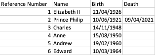
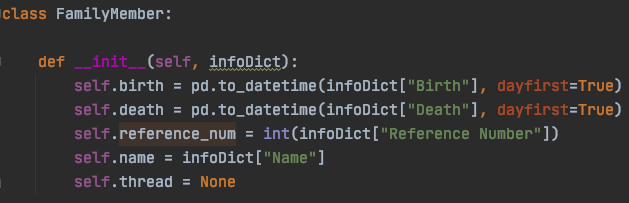
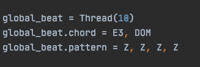

# family_sonification

## Technical Side
### Data Collection

Manual collection via CSV files, as well as choosing certain parameters personally with the subject.
### Data Processing

Basic processing using python, pandas etc.
### MIDI Sequencing

Sequencing was done using the Braid package by Brian House. Thanks Brian!
### Sound Design

MIDI output was ported to Ableton for further audio design work.
